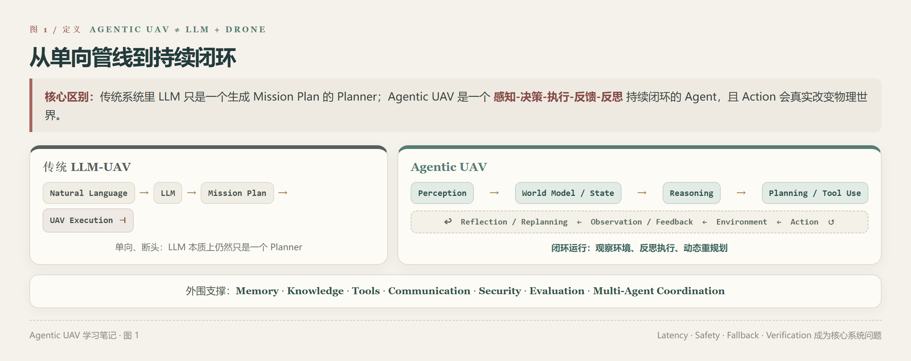
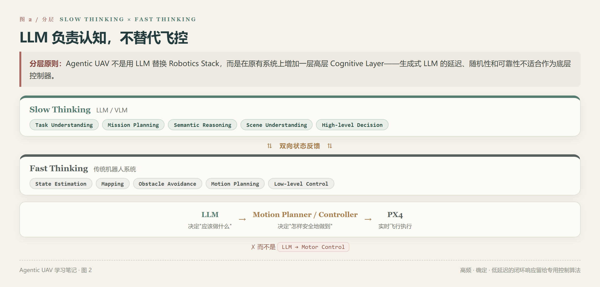
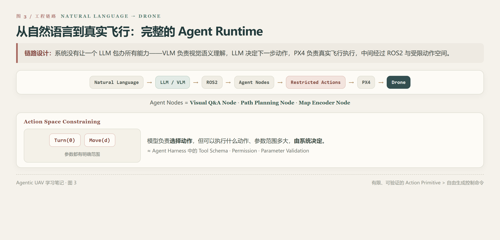
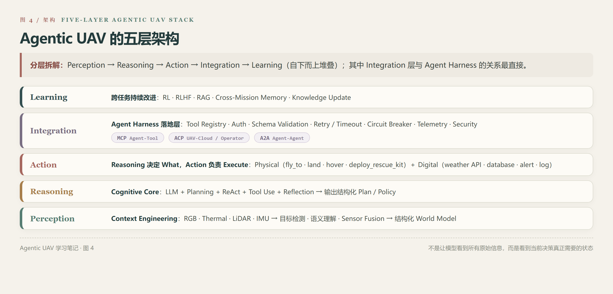
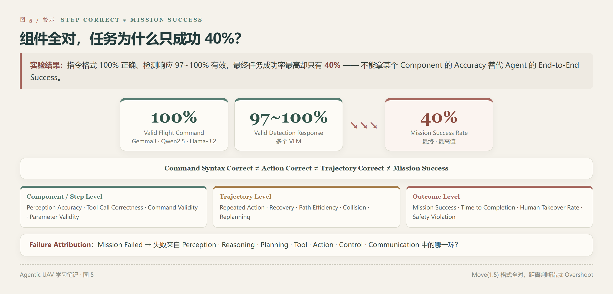
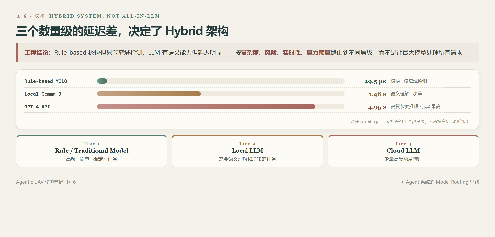
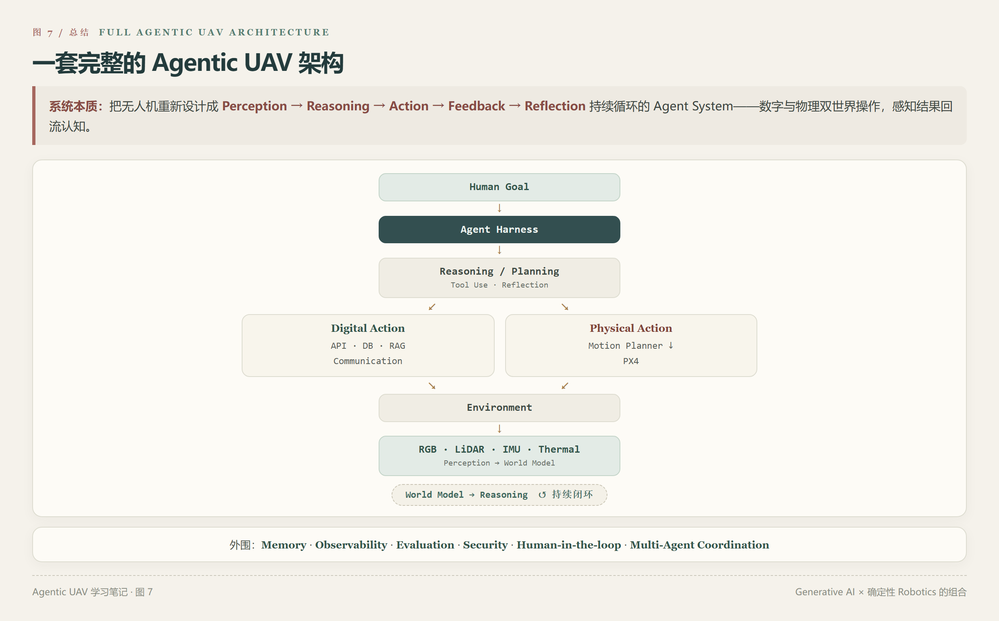

# Agentic UAV 学习总结：LLM、Agent 架构与无人机自治

 LLM × UAV / Agentic UAV 相关论文：*UAVs Meet LLMs: Overviews and Perspectives Toward Agentic Low-Altitude Mobility*、*General-Purpose Aerial Intelligent Agents Empowered by Large Language Models*、*Taking Flight with Dialogue: Enabling Natural Language Control for PX4-based Drone Agent*、*Agentic UAVs: LLM-Driven Autonomy with Integrated Tool-Calling and Cognitive Reasoning*。

几篇文章放在一起看之后，Agentic UAV 的核心其实并不是"让 LLM 控制无人机"，而是：

> **如何把 LLM 的高层认知能力，与感知、状态管理、任务规划、工具调用、飞控执行、环境反馈、记忆和外部系统组合起来，形成一个能够持续闭环运行的 Agent。**

---

## 1. Agentic UAV ≠ LLM + Drone

传统的 LLM-UAV 系统很多还是 **Natural Language → LLM → Mission Plan → UAV Execution** 的单向链路，LLM 本质上仍然只是一个 Planner。而 Agentic UAV 更接近一个持续闭环：

**Perception → World Model / State → Reasoning → Planning / Tool Use → Action → Environment → Observation / Feedback → Reflection / Replanning**

外围还需要 **Memory、Knowledge、Tools、Communication、Security、Evaluation、Multi-Agent Coordination** 等支撑能力。



综述 *UAVs Meet LLMs* 最后提出的 Agentic UAV 路线，本身就强调自主 Perception、Reasoning、Memory 和 Tool Utilization，并进一步加入 Manager Agent、任务分配、Agent Interaction 和 UAV Swarm。它讨论的已经不是简单的"LLM 辅助无人机"，而是一套 Agent Architecture。

这也是 Agentic UAV 和普通 Chat Agent 最大的区别之一：

> **Agent 的 Action 会真实改变物理世界。**

因此一次错误 Planning、Tool Call 或 Action 的代价远高于聊天系统中的一次错误回答，Latency、Safety、Fallback 和 Verification 都会变成核心系统问题。

---

## 2. LLM 负责高层认知，不应该直接替代飞控

*General-Purpose Aerial Intelligent Agents* 提出了一个很重要的分层：

- **Slow Thinking**（LLM / VLM 承担）：Task Understanding、Mission Planning、Semantic Reasoning、Scene Understanding、High-level Decision。
- **Fast Thinking**（传统机器人系统承担）：State Estimation、Mapping、Obstacle Avoidance、Motion Planning、Low-level Control。



两者通过双向状态反馈连接。因此合理的职责划分更接近——**LLM 决定"应该做什么"，Motion Planner / Controller 决定"怎样安全地做到"，PX4 负责实时飞行执行**，而不是 `LLM → Motor Control`。

原因也很直接：飞行控制通常需要高频、确定、低延迟的闭环响应，而生成式 LLM 的推理和 Token Generation 在延迟、随机性和可靠性上都不适合作为底层控制器。所以 Agentic UAV 并不是用 LLM 替换传统 Robotics Stack，而是在原有系统上增加一层高层 Cognitive Layer。

---

## 3. Natural Language 到真实飞行，中间需要完整的 Agent Runtime

*Taking Flight with Dialogue* 很适合观察具体工程链路。论文实现了一套 **Natural Language → LLM / VLM → ROS2 → Agent Nodes → Restricted Actions → PX4 → Drone** 的链路。



系统没有让一个 LLM 包办所有能力，而是拆出了 **Visual Q&A Node、Path Planning Node、Map Encoder Node**：VLM 负责视觉语义理解，LLM 根据任务 Context、当前状态、视觉信息和最近 Action History 决定下一步动作，PX4 负责真实飞行执行。

更值得注意的是，LLM 的动作空间被严格限制为 `Turn(θ)` 和 `Move(d)`，并且参数都有明确范围。这个设计本质上是在做 **Action Space Constraining**：

> 模型负责选择动作，但可以执行什么动作、参数范围多大，由系统决定。

这和 Agent Harness 中 Tool Schema、Permission、Parameter Validation 的思想完全一致。对于具身 Agent 来说，有限、可验证的 Action Primitive 往往比"让模型自由生成控制命令"更加可靠。

---

## 4. 真正完整的 Agentic UAV 可以拆成五层

*Agentic UAVs* 将整个系统明确拆成五层（自下而上）：

**Perception → Reasoning → Action → Integration → Learning**



### Perception Layer

不是简单把 Camera Frame 全部发送给 LLM，而是将 RGB、Thermal、LiDAR、IMU 等传感器信息经过目标检测、语义理解和 Sensor Fusion，形成结构化 World Model。例如：

```text
ego_pose
objects: [class, position, velocity, confidence]
relations: [person near exit]
sensor_health
```

这个设计本质上是在做 Context Engineering：

> **不是让模型看到所有原始信息，而是让模型看到当前决策真正需要的状态。**

### Reasoning Layer

相当于 Agent 的 Cognitive Core：**LLM + Planning + ReAct + Tool Use + Reflection**。它负责拆解 High-level Goal、根据当前 World State 生成计划、决定是否调用工具、根据执行结果 Reflection、失败后 Replanning。它输出的也不应该只是自然语言建议，而应该是 Action Layer 能继续执行的结构化 Plan / Policy。

### Action Layer

负责把 Reasoning 转换成真实动作，包括两类：

- **Physical Action**：`fly_to`、`land`、`hover`、`deploy_rescue_kit`
- **Digital Action**：`call weather API`、`query database`、`send alert`、`write incident log`

这里有一个很重要的职责分离：

> **Reasoning 决定 What，Action 负责 Execute。**

### Integration Layer

这一层和 Agent Harness 的关系最直接。论文把 **Tool Registry、Service Discovery、Authentication / Authorization、Schema Validation、Request Serialization、Retry、Timeout、Circuit Breaker、Cache、Telemetry、Logging、Observability、Security** 全部放到了 Integration Layer，同时引入 **MCP、ACP、A2A** 三种协议，分别处理 Agent-Tool、UAV-Cloud / Operator 和 Agent-Agent 的交互。

一个完整 Tool Call 因此不是 `LLM → API`，而是：

```text
Reasoning（决定调用什么 Tool）
   ↓
Action（提交 Tool Call）
   ↓
Integration（发现服务 · 认证 · 参数校验 · Retry / Timeout · 执行 · 记录 Trace）
   ↓
Action（获取结构化结果）
   ↓
Reasoning（更新状态并继续规划）
```

这实际上已经是一个标准的 Agent Harness 问题。

### Learning Layer

负责把一次 Mission 的结果变成未来能力：**RL、RLHF、RAG、Cross-Mission Memory、Knowledge Update**，最终形成 **Mission → Execution Trace → Outcome / Feedback → Learning / Memory → Next Mission** 的循环。所以 Agentic UAV 不只是一个能够完成当前任务的 Agent，还包含跨任务持续改进的设计。

---

## 5. UAV Agent 的 Tool 不只是飞行动作

Agentic UAV 一个很容易忽视的变化，是 Tool 的范围扩大了。传统 UAV 的能力主要是 **Physical Action**（Takeoff、Land、Fly、Hover、Capture Image），Agentic UAV 同时可以调用 **Digital Tool**（Weather API、Map Service、Database、Knowledge Base、Communication System、Emergency Notification）。

因此搜索救援任务可能变成：

```text
发现疑似倒地人员 → 分析现场状态 → 查询位置与天气 → 判断是否需要救援
→ 向医疗系统发送 GPS + Image → 部署 Rescue Kit → 记录 Incident
```

此时无人机已经不仅仅是一个 Autonomous Robot，而是一个同时能够操作 **Physical World + Digital World** 的 Agent。

---

## 6. Multi-UAV 也不只是传统"无人机编队"

传统 Swarm UAV 更多关注 **Formation、Collision Avoidance、Coverage、Trajectory Coordination**；Agentic UAV 中则进一步出现 **Task Decomposition、Task Allocation、Agent Negotiation、Shared World Model、Shared Memory、Knowledge Synchronization、Consensus**。

例如：

```text
Search & Rescue
       ↓
Global Planner / Manager Agent
       ↓
┌──────────┬──────────┬──────────┐
│ UAV A    │ UAV B    │ UAV C    │
│ Search   │ Verify   │ Relay    │
└──────────┴──────────┴──────────┘
       ↕ A2A Communication
       ↓
Shared Mission State
```

也就是说，未来的 UAV Swarm 不仅需要"动作协同"，还可能需要"认知协同"。不过目前这部分仍然更多属于架构方向——*Agentic UAVs* 的主要实验还是单 UAV 的 SAR 仿真，因此 Multi-Agent / Swarm Cognition 不能理解成已经完成充分验证。

---

## 7. Agent Eval 在 UAV 上更加重要：Step Correct ≠ Mission Success

*Taking Flight with Dialogue* 有一个非常典型的实验结果：Gemma3、Qwen2.5、Llama-3.2 的 **Valid Flight Command = 100%**，多个 VLM 的 Valid Detection Response 也达到 **97% ~ 100%**，但最终最高 **Mission Success Rate = 40%**。



这个结果非常能说明 Agent Evaluation 的问题：

**Command Syntax Correct ≠ Action Correct ≠ Trajectory Correct ≠ Mission Success**

例如 `Move(1.5)` 完全符合格式要求，但如果距离判断错误，就可能 Overshoot；同样 `Object Detected = Yes` 输出格式正确，也可能是 False Positive。

因此 UAV Agent 的 Eval 至少要分三层：

- **Component / Step Level**：Perception Accuracy、Tool Call Correctness、Command Validity、Parameter Validity。
- **Trajectory Level**：Repeated Action、Recovery、Path Efficiency、Collision、Replanning。
- **Outcome Level**：Mission Success、Time to Completion、Human Takeover Rate、Safety Violation。

最终还需要 **Failure Attribution**——Mission Failed 之后，回答失败来自 Perception、Reasoning、Planning、Tool、Action、Control 还是 Communication。也就是说：

> **不能拿某个 Component 的 Accuracy 替代 Agent 的 End-to-End Success。**

---

## 8. Agentic UAV 最终更可能是 Hybrid System，而不是 All-in-LLM

*Agentic UAVs* 的实验对三类方案进行了对比：

| 方案 | 平均处理时间 | 特点 |
| --- | --- | --- |
| Rule-based YOLO | **29.5 μs** | 极快，但只能完成较窄的检测任务 |
| Local Gemma-3 | **1.48 s** | 可做 Contextual Analysis 和 Action Recommendation，延迟明显 |
| GPT-4 API | **4.95 s** | 高复杂度推理，延迟与成本最高 |

因此论文最后更倾向于三层 **Tier 架构**：

- **Tier 1 — Rule / Traditional Model**：处理高频、简单、确定性任务。
- **Tier 2 — Local LLM**：处理需要语义理解和决策的任务。
- **Tier 3 — Cloud LLM**：处理少量高复杂度推理。



这其实与现在很多 Agent 系统的 Model Routing 思路一致——不是"最大模型处理所有请求"，而是**根据任务复杂度、风险、实时性和算力预算选择不同能力**。所以 Agentic UAV 更合理的技术栈可能是 **Traditional Algorithm + Small / Specialized Model + Local LLM / VLM + Cloud LLM + Agent Harness + Human**，而不是"All in LLM"。

---

## 9. 把几篇论文合起来，可以得到一套比较完整的 Agentic UAV 架构



外围还需要 **Memory、Observability、Evaluation、Security、Human-in-the-loop、Multi-Agent Coordination**。

真正的 Agentic UAV，不是简单增加一个 LLM，而是把无人机重新设计成 **Perception → Reasoning → Action → Feedback → Reflection** 持续循环的 Agent System。

---

## 10. 几个比较重要的工程边界

1. **LLM 不应该替代 Low-level Control**——高频、实时、安全关键的 State Estimation、Collision Avoidance 和 Control 仍应该由专门的 Robotics Algorithm 负责。
2. **Action Space 应尽可能受控**——与其让 LLM 自由生成控制命令，不如提供 **Tool Schema、Action Primitive、Parameter Range、Permission**，让 Harness 控制真正可执行的边界。
3. **Raw Sensor ≠ LLM Context**——Camera、LiDAR、IMU 的高频原始数据应该先经过 Perception 和 State Abstraction，形成更紧凑的 World Model，再提供给 Reasoning Layer。
4. **LLM 输出不能直接等价于执行**——中间需要 **Validation、Authorization、Risk Check、Retry、Timeout、Fallback、Logging**。
5. **Agent Eval 必须覆盖 End-to-End**——不能只看 Prompt Accuracy、Command Accuracy 或 Detection Accuracy，而要看完整 Mission 是否成功以及失败来自哪个 Component。

---

## 最后

Agentic UAV 真正值得讨论的问题，并不是"LLM 能不能控制无人机？"，更准确的问题应该是：

> **LLM 应该在无人机自治系统中承担什么职责？**

目前比较合理的答案可能是：

- **LLM / VLM** → 高层理解、推理、规划、语义决策
- **Agent Harness** → 状态、工具、权限、协议、编排、监控和容错
- **Traditional Robotics** → 感知算法、运动规划、避障、实时控制
- **PX4 / Controller** → 物理执行
- **Eval / Human** → 验证、监督与安全兜底

因此，Agentic UAV 的技术重点最终可能不只是"更强的 LLM"，而是：

> **如何把 Generative AI 和高度确定性的 Robotics System 组合成一个既有认知能力，又满足实时性、安全性和可控性的完整 Agent。**

这也是目前 Agentic UAV 最值得继续深入的方向。
