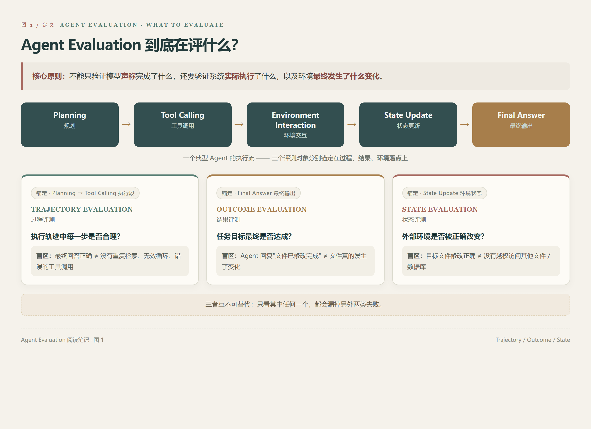
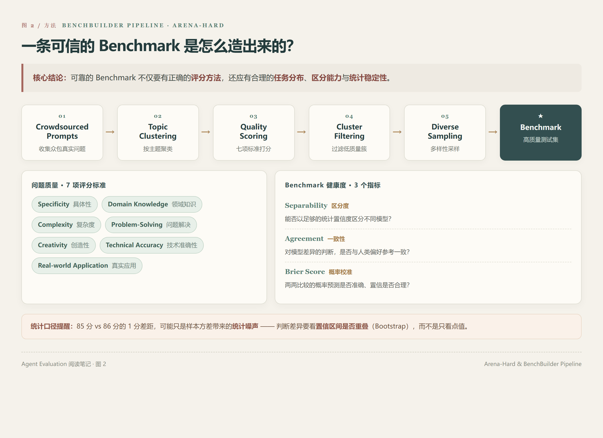
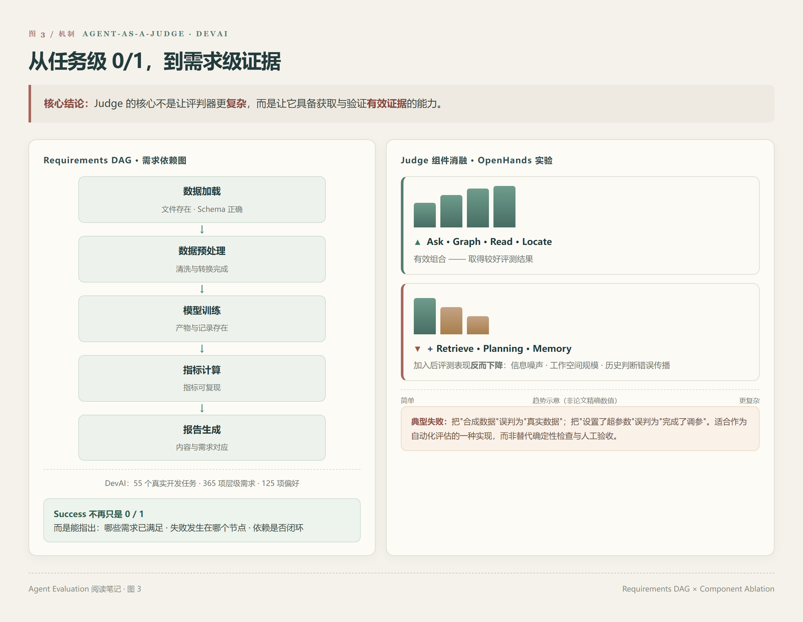
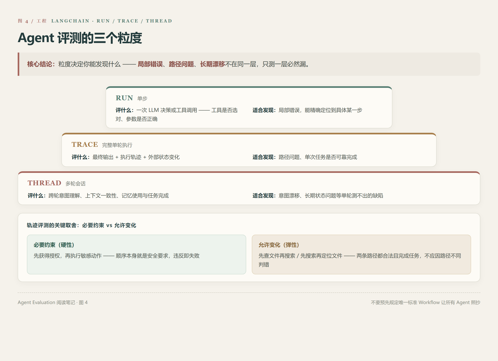
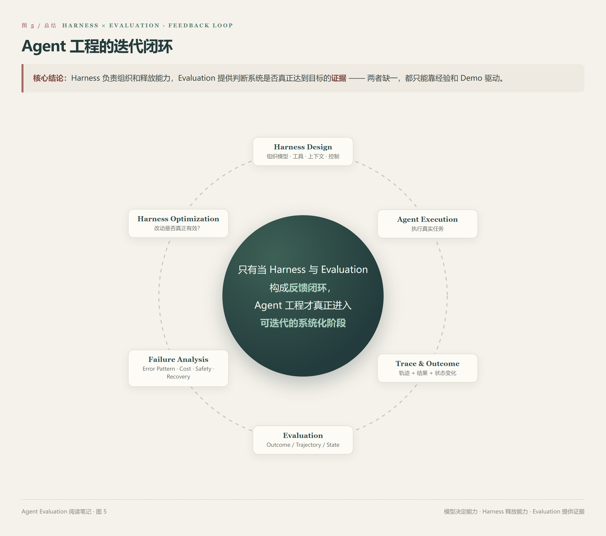

# 从 LLM-as-a-Judge 到 Agent Arena：读完 4 篇论文与 3 份工业实践，重新理解 Agent Evaluation

最近系统阅读了几篇 Agent Evaluation 相关资料，包括 ACL 2026 的 Agent 评测综述、经典 LLM-as-a-Judge、Arena-Hard、Agent-as-a-Judge，以及 Arena、LangChain 和火山引擎的工业界技术方案。

这些材料串联起来，形成了一条比较完整的技术脉络：

**评测体系 → 自动评分 → Benchmark 构建 → Agent 过程评测 → 真实环境评测 → 工程化闭环。**

Agent Evaluation 的核心问题已经不只是"模型回答得对不对"，而是如何可靠地测量一个具有状态、工具和执行能力的系统，是否真正完成了任务，以及它在什么地方发生了失败。

## 1. 为什么 Agent 不能沿用传统 LLM 的评测方式？

传统 LLM Evaluation 更多围绕输入与输出展开。例如，给模型一道数学题，检查答案是否正确；给出一个开放式问题，通过人工评价或 LLM-as-a-Judge 判断回答质量。

但 Agent 不再只是一个文本生成器。

一个典型 Agent 需要经历 Planning、Tool Calling、Environment Interaction、State Update 等多个环节。即使最终回答正确，也可能在过程中出现错误调用工具、重复检索、无效循环，甚至错误修改外部状态等问题。

ACL 2026 的《A Survey on Evaluation of LLM-based Agents》从核心能力、特定应用、通用智能体、Benchmark 维度和开发者评测框架五个视角整理了这一领域，并指出成本、安全、鲁棒性和细粒度评测仍是需要深入研究的问题。

因此，Agent Evaluation 至少需要区分三个基本对象：

- **Outcome Evaluation**：最终结果是否完成用户目标？
- **Trajectory Evaluation**：执行过程中是否出现错误决策、无效步骤或不合理的工具调用？
- **State Evaluation**：Agent 是否正确改变了外部环境，例如文件、数据库、日历或其他业务状态？

这三个对象并不能互相替代。

例如，一个文件修改 Agent 最终回复"文件已经修改完成"，并不代表文件真的发生了变化；即使文件修改正确，也不代表其执行过程中没有越权访问其他文件。

这就引出了一个重要原则：

> Agent Eval 不能只验证模型声称完成了什么，还需要验证系统实际执行了什么，以及环境最终发生了什么变化。

## 2. LLM-as-a-Judge：自动评分首先要解决的是评判器自身的可信度

《Judging LLM-as-a-Judge with MT-Bench and Chatbot Arena》是理解自动评价的重要起点。

论文研究了利用强模型代替人工评价开放式回答的可行性，并通过 MT-Bench 和 Chatbot Arena 检验 Judge 与人类偏好的匹配程度。

### 论文识别出的评判偏差

但这项研究真正值得关注的，并不只是模型与人类的一致率，而是作者明确识别出的几种评判偏差：**Position Bias**、**Verbosity Bias**、**Self-enhancement Bias**，以及推理能力不足。

例如，在 Pairwise Evaluation 中，同样两份答案，仅仅交换 A、B 的展示顺序，就可能改变 Judge 的判断。论文提出交换位置重新评估等方式，以缓解这种偏差。

这说明，使用 LLM-as-a-Judge 时，不能简单地设计一个 Prompt，让模型输出 1～5 分，就默认评分可信。

一套相对完善的评判机制需要考虑：

- **Rubric**：评分标准是否明确、可操作？
- **Consistency**：同一批样本重复评估，结论是否稳定？
- **Human Alignment**：自动评分与人工标注是否一致？
- **Bias Control**：是否存在位置、长度、表达风格等系统性偏差？
- **Calibration**：当 Judge 与人工评价冲突时，如何依据标注数据调整评估器？

### 一致性 ≠ 正确率

此外，还有一个特别容易被误解的地方：

> Judge 与人工标注的一致性，不等于 Judge 判断的客观正确率。

对于开放式问题，人类偏好本身可能存在分歧。因此，一致率回答的是"自动评判器在多大程度上复现了参考评价"，而不是"有多少判断符合某种绝对真值"。

对于能够通过代码、数据库状态或外部事实直接验证的任务，也没有必要把所有判断都交给 LLM。

**确定性问题优先使用确定性验证，语义性问题再引入 LLM-as-a-Judge。**

这比单纯增加 Judge 模型参数量更符合评测工程的实际需求。

## 3. Arena-Hard：不仅要评 Agent，还需要评 Benchmark 本身

评测结果是否可信，取决于评判器，也取决于测试集。

如果 Benchmark 中大量题目过于简单，模型普遍取得高分，就很难区分不同系统的真实能力。如果测试集长期不更新，又可能面临数据污染、能力饱和和任务分布脱节等问题。

《From Crowdsourced Data to High-quality Benchmarks: Arena-Hard and BenchBuilder Pipeline》讨论的正是这个问题。

论文提出 BenchBuilder，从众包用户问题中自动筛选高质量样本。其流程可以概括为：

**Crowdsourced Prompts → Topic Clustering → Quality Scoring → Cluster Filtering → Diverse Sampling → Benchmark。**

作者使用 **Specificity**、**Domain Knowledge**、**Complexity**、**Problem-Solving**、**Creativity**、**Technical Accuracy** 和 **Real-world Application** 七项标准评价问题质量，再通过主题聚类与采样生成具有一定多样性和挑战性的测试集。

更重要的是，论文没有仅凭"题目更难"就认定 Benchmark 更好，而是提出三个指标：

- **Separability with Confidence**：测试集能否以足够的统计置信度区分不同模型？
- **Agreement with Confidence**：Benchmark 对模型之间差异的判断，是否与人类偏好参考结果一致？
- **Pair Rank Brier Score**：Benchmark 对模型两两比较的概率预测是否准确，置信程度是否合理？

这里有一个非常值得注意的问题：两个模型分别取得 **85 分和 86 分**，能否直接认定后者表现更好？

不一定。

如果测试集太小、样本方差较大，或者模型输出存在较强随机性，那么这一分的差异可能只是**统计噪声**。

论文因此引入 **Bootstrap 和置信区间**，并用模型得分置信区间不重叠的比例衡量区分能力。

另外，Arena-Hard 的实验也讨论了风格偏差控制。例如，将答案长度、Markdown 标题和列表等因素纳入统计模型，以降低表达形式对偏好评价的干扰。

论文报告的 **98.6%** 也需要明确统计口径：它对应特定英语困难题分布及参考排序条件下的评测结果，不能直接解释为 Judge 对所有任务具有 98.6% 的正确率。

这篇论文带来的核心启发是：

> 一个可靠的 Benchmark，不仅要有正确的评分方法，还应具有合理的任务分布、区分能力、统计稳定性和明确的适用范围。

对于业务 Agent，同样不能只使用几十条随机生成的问题，就直接用准确率代表线上真实表现。

## 4. Agent-as-a-Judge：从评价最终答案，进一步走向评价执行过程

前面的 LLM-as-a-Judge 主要面向回答质量，但 Agent 的输出可能是一整个软件项目、一批文件或复杂的任务执行过程。

《Agent-as-a-Judge: Evaluate Agents with Agents》提出了一种扩展思路：使用具有工具访问和信息检索能力的 Agent 来评价其他 Agent。

论文同时构建了 DevAI Benchmark，包含 **55 个真实 AI 开发任务、365 项层级需求和 125 项偏好要求**。

### Requirements DAG：从任务级 0/1 到需求级评测

这里最值得学习的是 Requirements DAG。

例如，一个模型开发任务可以拆成：

**数据加载 → 数据预处理 → 模型训练 → 指标计算 → 报告生成。**

每个节点对应具体的验收标准，节点之间则存在依赖关系。

因此，任务完成情况不再只能表示为：

`Success = 0 / 1`

而可以进一步衡量哪些需求满足了、哪些依赖尚未完成、最终任务失败发生在哪个阶段。

### Judge 组件消融：不是越复杂越好

论文设计的 Judge 最初包含 **Graph、Locate、Read、Search、Retrieve、Ask、Memory、Planning** 八个组件，通过消融实验发现，不是所有组件都能提供正向收益。

在 OpenHands 的实验中，**Ask、Graph、Read 和 Locate 的组合**取得了较好的结果，而加入某些额外检索、规划和记忆机制后，评测表现反而下降。作者将其与信息噪声、工作空间规模，以及历史判断错误传播等因素联系起来。

这也说明：

**Agent-as-a-Judge 的核心不是让 Judge 变得更复杂，而是让它具备获取和验证有效证据的能力。**

在实际评测中，Judge 可以通过读取项目文件、分析执行日志、检查生成产物等方式，为每项需求建立证据链。

不过，它依然存在局限。

论文附录展示了两种典型失败：Judge 将合成数据误认为真实数据，以及将代码中设置了超参数误判为真正完成了超参数调优。

所以，Agent-as-a-Judge 更适合作为自动化评估的一种实现方式，而不是替代所有确定性检查和人工验收。

## 5. 工业界开始把 Agent Eval 拆成不同执行粒度

LangChain 在《Evaluating AI Agents at the Run, Trace, and Thread Level》中提出了一个比较实用的工程视角：根据 Agent 的执行结构，将评测分成 Run、Trace、Thread 三个层级。

- **Run：单步评测。** 关注某次 LLM 决策或工具调用，例如工具是否选对、参数是否正确。
- **Trace：完整单轮执行评测。** 综合检查最终输出、执行轨迹和外部状态变化。
- **Thread：多轮会话评测。** 关注跨轮次的意图理解、上下文一致性、记忆使用与任务完成情况。

三者的价值并不相同。

Run 适合定位具体错误，Trace 适合验证单次任务是否可靠，Thread 则适合发现单轮测试无法暴露的长期交互问题。

这里还存在一个重要的工程取舍：Trajectory Evaluation 不应该默认使用完全严格的步骤匹配。

例如，某个 Agent 可以先查文件再搜索，另一个 Agent 可以先搜索再定位文件。只要两条路径都合法，并最终完成任务，就不应该因为路径不同而自动判错。

但对于必须满足严格顺序的安全操作，例如先获得授权再执行敏感动作，顺序就应当成为硬性约束。

因此，轨迹评测需要区分：

**必要约束与允许变化的执行路径。**

这比预先规定一条标准 Workflow，让所有 Agent 完全照着执行，更符合非确定性系统的特点。

## 6. Agent Arena：评测进一步进入真实环境和因果分析

2026 年的《Agent Arena: Causal Evaluation of Agents in the Real World》提供了另一个研究方向。

传统 Arena 主要依赖回答之间的偏好比较，而 Agent Arena 尝试从真实执行过程中提取评价信号，包括用户确认成功、表扬与投诉、用户纠正后的响应情况、Shell 错误恢复和工具幻觉。

这种变化非常重要。

对于复杂 Agent，用户未必能直接比较两条完整执行轨迹，但真实任务中会留下大量行为信号，例如：

用户是否接受结果？是否反复纠正 Agent？工具出错后是否恢复？是否调用了不存在的工具？

这些信号可以帮助评价系统在真实环境中的表现。

不过，真实用户反馈还面临一个问题：

观察到 A 配置比 B 配置表现更好，不代表差异一定由模型或某个 Harness 组件造成。

它们可能面对了不同难度的任务、不同用户群体或不同环境。

Agent Arena 因此引入 **Causal Tracing**，通过随机分配组件配置，分析不同选择对应的结果变化，尝试估计组件带来的因果效应。

但需要保留一个研究边界：2026 年 6 月发布的首个榜单实际评测的是主 Orchestrator 模型，多组件 Harness 评测属于后续扩展方向，不能将其理解为已经完整验证了所有 Harness 组件的独立贡献。

这一研究方向可以进一步引出一个值得思考的问题：

> 当 Model、Context Strategy、Tool Interface 和 Verification 同时变化时，应该如何区分究竟是哪一项改动带来了性能提升？

从工程角度看，**控制变量、消融实验、随机分配与统计置信度**，都会成为 Agent Eval 需要考虑的方法。

## 7. 工业界实践：评测必须从一次实验变成持续运行的系统

学术论文更多讨论评价对象、方法和有效性，而工业界需要进一步回答：怎样把这些方法融入日常开发？

LangChain 的工业实践强调离线评测与线上评测的互补。

**Offline Evaluation** 通过固定测试集验证已知场景，适合版本对比与回归测试；**Online Evaluation** 通过真实流量发现未知问题、边界情况和使用分布变化，再将失败样本回流到离线数据集。

火山引擎 AgentKit 的公开文档则将评测组织为评测集、评估器和评测实验等基本对象，同时支持不同评估方式以及人工校准。

这两套公开方案可以归纳出一条通用的工程链路：

**Dataset → Agent Execution → Trace Collection → Evaluators → Experiment Comparison → Failure Analysis → Regression Testing。**

其中，评估器也不应只有一种。

**规则或代码评估器**适合检查输出 Schema、工具参数和外部状态等客观条件；**LLM Judge** 适合处理相关性、完整性和语义合理性；**人工评审**则负责处理有争议、高风险或需要领域专业知识的样本。

真正需要避免的是，把某个评测平台的 Score 当成系统质量本身。

平台能够管理 Trace、执行评估器、汇总结果，但评测是否可信，最终仍取决于测试集、评分标准、实验设计和评估器校准。

## 8. 如果重新设计一套 Agent Evaluation，应该如何组织？

综合这些研究，可以将 Agent Evaluation 理解为六个相互关联的环节。

**第一，定义评测目标。** 明确评测对象究竟是基础模型、某项 Agent 能力、完整任务，还是 Harness 中的某个组件。不同目标对应不同数据、指标和实验设计。

**第二，构建测试集。** 除了正常样本，还应考虑困难样本、边界条件、异常输入、工具失败与多轮交互，并根据真实业务分布进行适当分层。

**第三，设计混合评估器。** 对能够确定性验证的要求使用规则和执行检查，对语义质量使用 LLM Judge，对高风险和歧义样本保留人工评价。

**第四，采集完整执行信息。** 除最终答案外，还应记录必要的工具调用、环境反馈、状态变化、耗时和成本，让失败能够被定位。

**第五，保证实验可比性。** 对比不同模型或 Harness 配置时，尽量控制测试集、环境、预算和其他配置。对于非确定性任务，需要考虑重复实验、分组指标及统计不确定性。

**第六，建立持续回归机制。** 将线上出现的典型失败转化为测试用例，确保后续 Prompt、模型、工具或 Workflow 发生变化时，能够检测旧问题是否复现。

这套流程并不依赖 LangSmith、Langfuse 或某个特定厂商平台，而是一种可以迁移的评测工程方法。

## 9. Agent Evaluation 中最容易混淆的几个概念

几篇文章读下来，有四个区别尤其值得明确。

- **Observability ≠ Evaluation**。Trace 能告诉我们 Agent 做了什么，但并不能自动判断它做得是否正确。评测还需要明确的标准、指标和判定逻辑。
- **Judge Agreement ≠ Correctness**。Judge 与人类评价高度一致，说明它较好地复现了参考判断，但并不能证明所有评价都是客观正确的。
- **Benchmark Score ≠ Production Reliability**。固定测试集能帮助比较系统表现，但线上任务分布、环境变化和长期状态问题，可能带来完全不同的失败模式。
- **Correlation ≠ Causation**。某个 Agent 版本的成功率提升，不能直接证明某个新增 Harness 模块就是原因，需要合理控制其他变量。

这些区别看起来属于评测理论，但实际上会直接影响系统优化方向。

如果评测指标设计有问题，后续再精细的 Prompt 优化、模型选择或 Harness 调整，也可能只是对错误目标进行优化。

## 10. 最终：Agent Eval 是连接模型、Harness 与真实业务的反馈机制

把 Agent Harness 和 Agent Evaluation 放在一起看，两者之间的关系会更加清晰。

Harness 负责组织模型、工具、上下文、执行环境和控制机制；Evaluation 则负责判断这些设计是否真正改善了系统表现。

两者可以形成一个持续迭代的闭环：

**Harness Design → Agent Execution → Trace & Outcome → Evaluation → Failure Analysis → Harness Optimization。**

例如，加入 Planning 是否提高了任务成功率？Memory 是否真正改善了多轮交互？Verifier 带来的可靠性收益能否覆盖额外成本？权限约束是否有效阻止了不安全操作？

这些问题不能只通过架构图回答，需要对应的评测数据和实验结果。

而且，Agent Eval 的价值也不只是给系统打一个总分。

更重要的是，它能够回答：

系统失败在什么地方、失败是否具有规律、哪些改动真正有效，以及是否值得付出额外的延迟和成本。

读完这些材料，一个比较清晰的认识是：

> Agent Evaluation 的目标，不是找到一个能够给所有 Agent 打分的万能 Judge，而是建立一套能够持续、可信地衡量任务结果、执行过程和系统行为的方法。

**模型决定基础能力，Harness 负责组织和释放能力，而 Evaluation 提供判断系统是否真正达到目标的证据。**

当这三者形成可验证的反馈闭环，Agent 工程才有可能从依赖经验和个别 Demo，逐渐走向基于数据与实验的系统化迭代。

