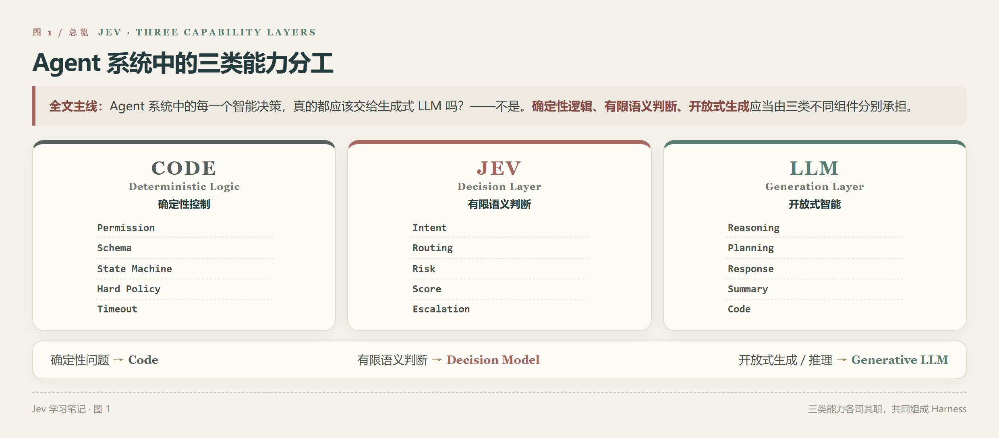
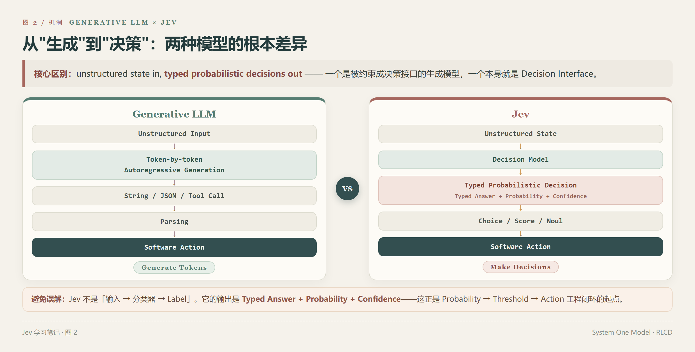
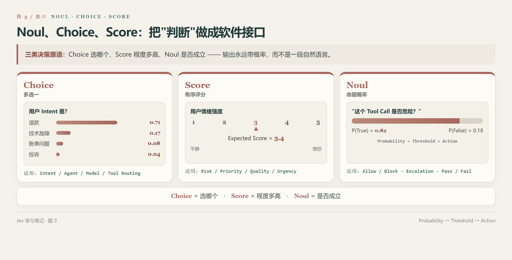
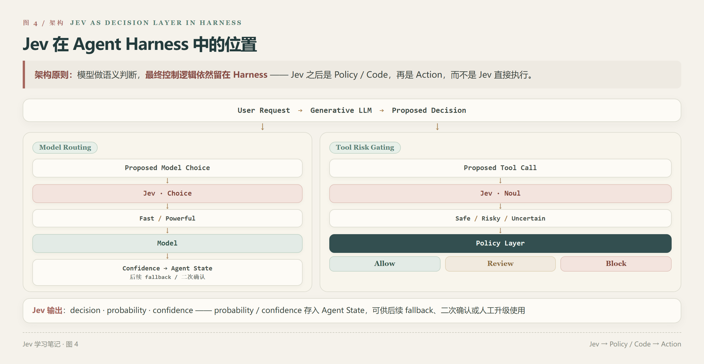
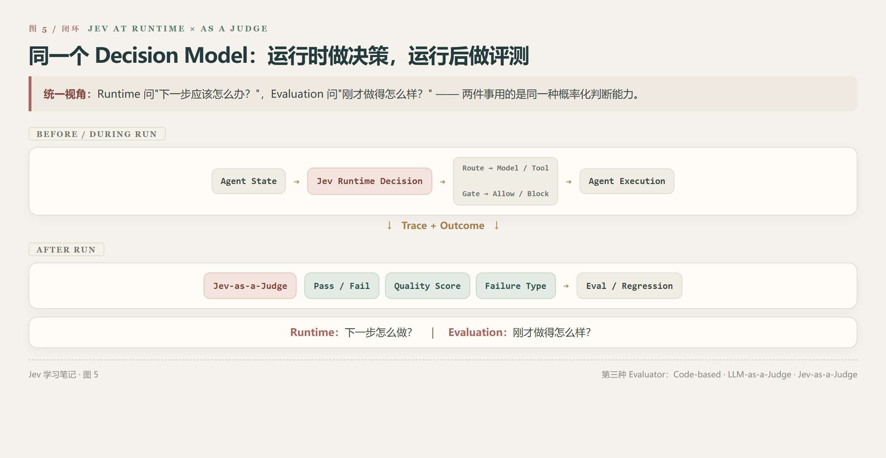
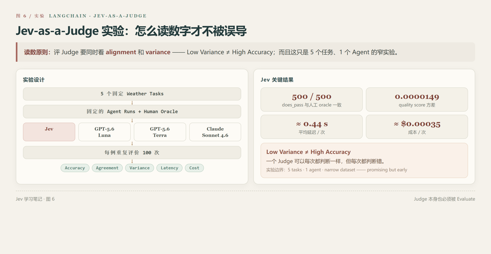
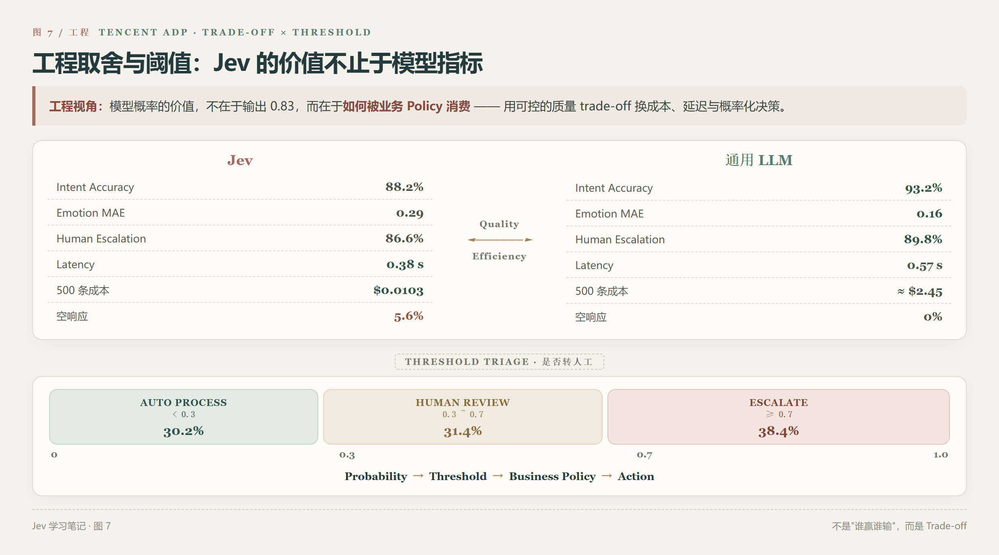

# Jev 学习总结：原理、Agent 中的使用与工程实践

最近集中看了几篇关于 Jev 的文章，包括 TypeSafe 对 System One Model 的介绍、Workflow Evals、LangChain 关于 Jev 在 Agent Harness 和 Agent Evaluation 中的实践，以及腾讯云 ADP 对 Jev 和通用大模型的工程对比。最开始关注 Jev，是因为它最近在 Agent 圈子里讨论得比较多。

但几篇文章读下来，我觉得 Jev 真正有意思的地方，并不是"它比某个 LLM 快多少、便宜多少"，而是它提出了一个很值得讨论的 Agent Engineering 问题：

> **Agent 系统中的每一个智能决策，真的都应该交给生成式 LLM 吗？**

这也是理解 Jev 最好的切入点。



---

## 1. Agent 里其实存在大量"不需要生成"的决策

传统 Agent Loop 大致是：

```text
User → LLM → Tool Call → Environment → LLM → Next Action → ...
```

随着 Agent 系统越来越复杂，会不断出现一些中间判断：

- 用户属于哪个 Intent？应该进入哪个 Agent？
- 应该使用哪个模型？应该调用哪个 Tool？
- 当前 Tool Call 有没有风险？是否值得 Retry？
- 是否应该升级人工？当前结果是否已经满足要求？

这些问题有一个共同特点：**它们通常不需要模型生成一大段自然语言**。系统真正需要的往往只是 **A / B / C 选哪个**、**Yes / No**，或者**风险到底有多高**。

但现在大量 Agent 系统的处理方式仍然是：

```text
State → Generative LLM → 生成一段文字 / JSON → 解析 → 转换成控制流
```

也就是说，我们实际上是让一个擅长**生成字符串**的模型，去承担一个本质上属于**决策**的问题。Jev 的出发点就是重新处理这件事情。

---

## 2. Jev 到底是什么？

TypeSafe 将 Jev 定义为第一款公开的 **System One Model**。它与传统生成式 LLM 最大的区别，可以非常粗略地概括成：



TypeSafe 对它的概括非常直接——**unstructured state in, typed probabilistic decisions out**：输入非结构化状态，直接输出带概率的类型化决策。TypeSafe 还为这类模型提出了 RLCD（**Reinforcement Learning for Calibrated Decisions**），并称 Jev 使用了新的模型架构和 parallel sampler。

不过目前 Jev 仍处于 early access，TypeSafe 并没有公开完整训练 recipe 或足够详细的 methods paper，所以对底层机制的理解目前仍然应该严格限定在官方公开信息范围内。

---

## 3. Noul、Choice、Score：Jev 把"判断"做成了软件接口



Jev 最核心的三个 Primitive 是 **Noul、Choice、Score**，可以分别理解成三类决策。

### Choice：从有限选项中选择一个

例如"用户 Intent 是什么？——A. refund / B. technical_support / C. billing / D. complaint"。这非常适合 **Intent / Agent / Skill / Model / Tool Routing** 一类的路由场景。

### Score：在有序尺度上评分

例如在 1（非常平静）到 5（非常愤怒）的量表上评估当前用户情绪，可以用在 **Risk Score、Priority、Quality、Frustration、Urgency** 等任何"程度"型判断上。

### Noul：判断一个命题是否成立

例如"这个 Tool Call 是否存在风险？"。Jev 返回的重点不是一句 `Yes`，而是类似 `P(True) = 0.82`。于是系统就可以进一步设计：

```text
p < 0.3      → 自动执行
0.3 ≤ p < 0.7 → 二次确认
p ≥ 0.7      → Block / Human Approval
```

这件事情对 Agent 工程非常重要，因为 **Probability 本身不是最终产品，Probability → Threshold → Action 才是真正的工程闭环**。

---

## 4. Jev 和 Structured Output 并不是一回事

这是我觉得特别容易混淆的一点。现在的 LLM 已经支持 **JSON Mode、Structured Output、Function Calling**，所以很容易产生一个问题：如果 LLM 本来就能输出 JSON，为什么还需要 Jev？

区别在于：

```text
LLM + Structured Output：生成模型 → 生成受约束的 Tokens → 得到结构化结果
Jev：                   State → Decision → Typed Answer + Probability
```

所以二者看起来可能最终都得到 `{"intent": "refund"}`，但模型解决问题的方式并不相同：一个是 **Generative Model 被约束成决策接口**，另一个是**模型本身就是 Decision Interface**。这也是 Jev 最值得观察的地方。

---

## 5. Jev 放进 Agent Harness 后，第一个典型场景是 Routing

LangChain 的《Building a Harness with Jev》给出了一个很典型的使用方式：**Model Routing**。

例如一个 Agent 同时拥有 **Fast Model** 和 **Powerful Model**。传统情况下，我们可能再调用一个 LLM 判断"这个问题复杂吗？"，再根据结果选择模型；而 Jev 可以直接承担：

```text
Request → Jev Choice → Fast / Powerful
```

这样，Routing 本身就成为一个独立 Decision Node。LangChain 还强调，Jev 的 probability 和 confidence 可以继续保存在 Agent State 中，而不是路由完之后直接丢弃，因此后续 Harness 还可以根据置信度执行 fallback 或其他策略。

这也让我重新理解了 Routing：

> Routing 不一定只是一个 Prompt，它本身可以成为一个需要独立设计、评测和优化的 Harness Component。



---

## 6. 第二个有意思的应用：Tool Risk Gating

另一个非常典型的场景是：

```text
LLM 想执行一个 Tool → Jev → 这个动作危险吗？ → Allow / Block / Escalate
```

LangChain 在文章中就展示了在工具真正执行之前，用 Jev 判断 Tool Call 风险的模式。但这里有一个非常重要的边界：**Jev 不应该替代 Hard Rule**。比如，如果规则本身明确——**不能删除 production database**——就应该直接：

```python
if environment == "production" and operation == "delete_database":
    block()
```

而不是让任何模型判断。因此我现在更倾向于把 Guardrail 分成三层：

- **Layer 1 — Deterministic Rule**：确定性权限 / Schema / 白名单
- **Layer 2 — Semantic Decision**：Jev
- **Layer 3 — Human Approval**：高风险 / 低置信度 / 不可逆操作

> **能写成代码的安全规则，不要交给模型。只有真正依赖语义和上下文的灰区判断，才需要智能模型。**

---

## 7. 更有意思的是：Jev 不只能控制 Agent，还能评价 Agent

看完 Harness 之后再看 LangChain 的 Jev-as-a-Judge，会发现两件事情其实是统一的：Agent Runtime 中，Jev 判断**"下一步应该怎么办？"**；Agent Evaluation 中，Jev 判断**"刚才做得怎么样？"**。

所以 Evaluation 同样可以写成 **Agent Trace → Jev → Pass / Fail · Quality Score · Failure Type**，这就形成了第三种 Evaluator：**Code-based Evaluator、LLM-as-a-Judge、Jev-as-a-Judge**。



---

## 8. Code、LLM Judge 和 Jev Judge，其实各有适用范围

我现在更倾向于这样理解三者。

### Code Evaluator

适合判断**有没有调用某个 Tool、参数是否合法、数据库状态是否真的变化、输出 Schema 是否正确**，优势是**快、便宜、确定、可复现**，缺点是无法解决复杂语义判断。

### LLM-as-a-Judge

适合判断**回答是否完整、是否有帮助、解释是否合理、整体轨迹是否符合任务目标**，优势是能处理复杂、开放的语义，但也存在 **Cost、Latency、Variance、Judge Bias、Calibration** 等问题。

### Jev-as-a-Judge

则更适合位于两者之间：**问题具有语义性，但输出空间是明确的**。例如"回答是否由证据支撑（Yes / No）"，或者"失败属于哪一类（Retrieval / Tool / Planning / Generation）"。

---

## 9. LangChain 的 Jev-as-a-Judge 实验很有意思，但必须正确读数字

LangChain 使用了一个天气 Agent，构建了包含 **5 个固定请求**的数据集，然后让 Jev、GPT-5.6 Luna、GPT-5.6 Terra 和 Claude Sonnet 4.6 对相同 Agent Run 进行重复评价：每个 Judge 分别输出 **quality**（连续分数）与 **does_pass**（二元判断），并对相同样本重复执行 100 次。

在这组特定实验中，Jev 的二元判断 500/500 次与人工 oracle 一致，同时 quality score 的方差显著低于几种 LLM Judge；文章还报告 Jev 平均约 0.44 秒/次、$0.00035/次。



但这里最值得记住的其实不是这些数字，而是——**Accuracy 和 Variance 是两件事**。一个 Judge 可以**每次都判断一样**，但**每次都判断错**，所以 **Low Variance ≠ High Accuracy**。LangChain 自己也明确强调这一点，并指出这个实验只有一个 Agent、一个很窄的数据集，因此结果是 promising but early，不能直接外推成"Jev 普遍优于 LLM Judge"。这个实验其实很好地连接了之前 Agent Eval 里学到的一个原则：

> **Judge 本身也必须被 Evaluate。**

---

## 10. 腾讯云 ADP 的实验让我对 Jev 的工程边界更清楚

如果只看 TypeSafe 和 LangChain，很容易产生一种感觉：Jev 好像什么判断任务都比 LLM 更好。腾讯云 ADP 的对比实验反而提供了一个比较冷静的工程视角。

他们构建了 **500 条模拟客服工单**，比较 Jev 与通用 LLM 在 **Intent Classification、Emotion Scoring、Human Escalation** 三个任务上的表现。结果并不是 Jev 全面领先：

| 指标 | Jev | LLM |
| --- | --- | --- |
| 总体 Intent Accuracy | 88.2% | **93.2%** |
| 情绪评分 MAE | 0.29 | **0.16** |
| 转人工准确率 | 86.6% | **89.8%** |

LLM 在这些质量指标上整体更高。但 Jev 平均处理时间约 **0.38 秒/条**，对比 LLM 的 0.57 秒/条；500 条成本约 **$0.0103**，而文章估算的 LLM 方案约 $2.45。与此同时，Jev 还出现了 **5.6% 空响应**。

所以真正合理的结论不是 **Jev > LLM**，而更接近——**Jev 在某些高频、有限输出空间的判断任务中，可以用一定的质量 trade-off 换取显著的成本、延迟和概率化决策优势**。这才是比较有价值的工程判断。



---

## 11. Jev 最有价值的地方，可能其实是 Threshold

腾讯云 ADP 的实验中，"是否转人工"不是简单输出 **Yes / No**，而是得到概率后划分：**< 0.3 自动处理、0.3 ~ 0.7 人工复核、≥ 0.7 转人工**。

这让我觉得 Jev 真正值得关注的，并不只是"它会分类"，而是它让**模型预测**进一步变成 **Probability → Threshold → Business Policy → Action**。例如：如果漏掉高风险请求的成本很高，就降低 threshold、提高 Recall、接受更多人工复核；如果人工成本很高，就扩大自动处理区间、降低人工量、接受一定误判风险。

这样模型选型就不再只是"谁 Accuracy 高 2%？"，而变成：

> **Accuracy、Recall、Cost、Latency、Human Workload 和 Risk 之间怎么权衡？**

这其实已经进入真正的 AI Engineering。不过还要注意一点：腾讯云文章虽然报告了 Jev 的 probability 和平均 confidence，但并没有提供 ECE、Brier Score、Reliability Diagram 等独立 Calibration 指标，因此不能仅凭"模型给出了 0.9"就推导出"它的 90% 概率在这个业务里已经严格校准"。

---

## 12. 所以现在我更倾向于把 Agent 系统拆成三个智能层次

读完这些材料之后，我目前更喜欢下面这种架构：

```text
                Agent System
                     │
         ┌───────────┼───────────┐
         │           │           │
      Code          Jev         LLM
确定性控制       有限语义判断    开放式智能
权限             Intent         Reasoning
Schema           Routing        Generation
State Machine    Risk           Explanation
Timeout          Score          Planning
Hard Policy      Escalation     Conversation
         │           │           │
         └───────────┼───────────┘
                     ↓
       Action → Trace / Outcome → Eval
```

对应一个很简单的判断原则：

- **能确定性计算的，用 Code**——Schema Validation、Permission、Balance Check、Timeout。
- **需要语义理解、但答案空间有限的，可以考虑 Jev**——Intent、Route、Risk、Priority、Escalation、Pass / Fail。
- **需要开放式生成和复杂推理的，用 Generative LLM**——Plan、Explanation、Summary、Code、Response。

这三者不是竞争关系，而应该是 **Code + Decision Model + Generative Model** 共同组成 Harness。

---

## 13. Jev 对 Agent Harness 的启发，可能比 Jev 本身更重要

即使未来 Jev 本身没有成为行业标准，我觉得它提出的问题依然值得保留：

> **为什么 Agent Harness 中所有需要"智能"的地方，都必须调用同一种生成式 LLM？**

我们现在已经开始拆 **Embedding Model、Reranker、LLM、Vision Model、ASR、TTS**，那么进一步拆出 **Decision Model** 其实也很自然。Agent 最终可能并不是"一个越来越强的 LLM + 越来越多的 Tools"，而更像"**不同模型 + 不同决策机制 + 确定性程序 + 执行环境 + Eval**"共同形成的系统。这也是 Jev 给我的最大启发。

---

## 14. 但 Jev 目前仍然需要保留几个问号

Jev 是 2026 年 9 月才公开的第一款 System One Model，目前仍处于 early access。TypeSafe 对 RLCD、新架构和 Parallel Sampler 的介绍仍然比较高层，完整 methods 细节尚未公开。因此现在还有几个很值得继续观察的问题：

1. **Calibration 到底能不能跨领域稳定成立？** 不是模型会输出 probability，就代表 probability 一定可靠。
2. **Jev 和强 Embedding Classifier / Fine-tuned Classifier 相比到底怎么样？** 对于非常稳定的业务 Intent，传统分类模型也可能非常便宜、稳定。
3. **Decision Model 和 Small LLM Router 的边界在哪里？** 有些任务也可以通过一个小参数 LLM + Structured Output 解决。
4. **复杂 Decision 能不能保持优势？** 当 **Choice 从 5 个增加到 100 个**，或者**判断需要长上下文、多跳推理**时，Jev 的优势是否还存在，需要更多验证。
5. **Jev 在真实 Production Distribution 上是否依然稳定？** 腾讯云实验中的 5.6% 空响应就是一个提醒——Benchmark 指标之外，Production Reliability 同样重要。

---

## 最后

读完 Jev 相关的这些文章之后，我现在对它的理解已经不再是"一个比 LLM 更快、更便宜的新模型"，而是：

> **一种尝试把"判断"从生成式 LLM 中独立出来的模型范式。**

它带来的一个很有意思的 Agent 架构问题是：**这个步骤到底是在生成、判断，还是执行确定性逻辑？** 如果是生成 → LLM；判断 → Decision Model；确定性逻辑 → Code。那么很多 Agent 系统可能根本不需要让一个大型生成模型承担整个 Harness 中的所有职责。

我觉得这也是 Jev 目前最值得继续观察的地方：

> **未来 Agent 的进步，可能不仅来自更强的基础模型，也来自我们开始更认真地决定——哪些事情根本不应该交给基础模型。**
